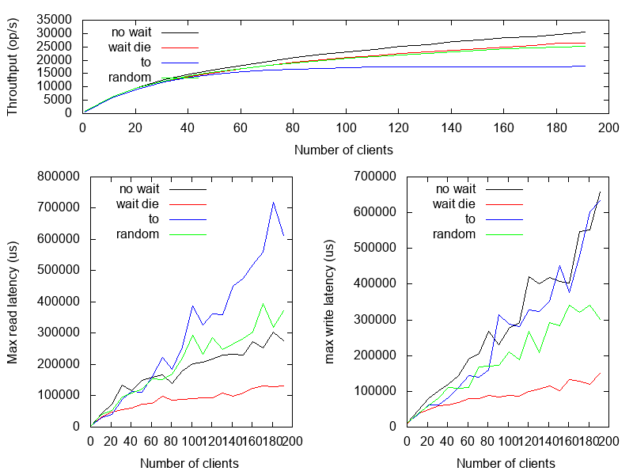
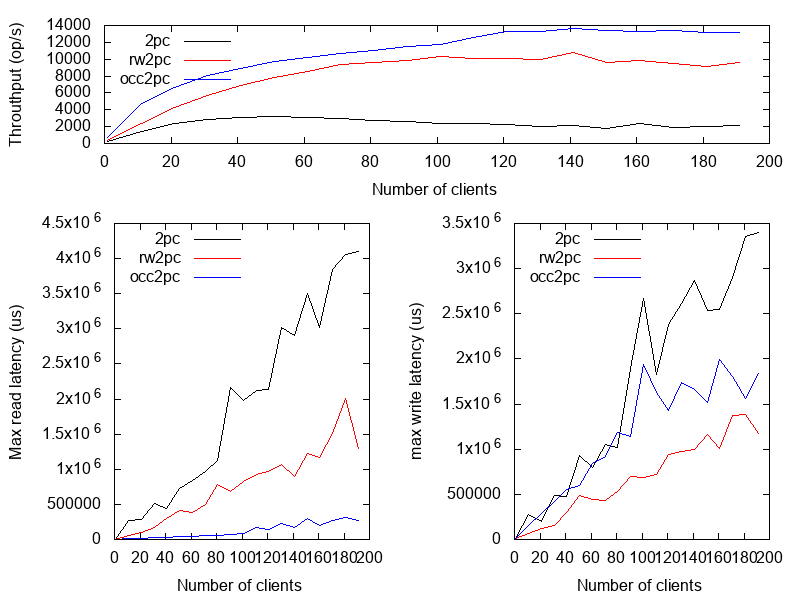
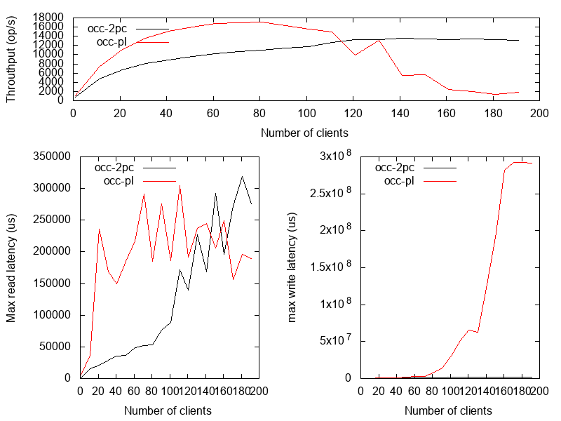
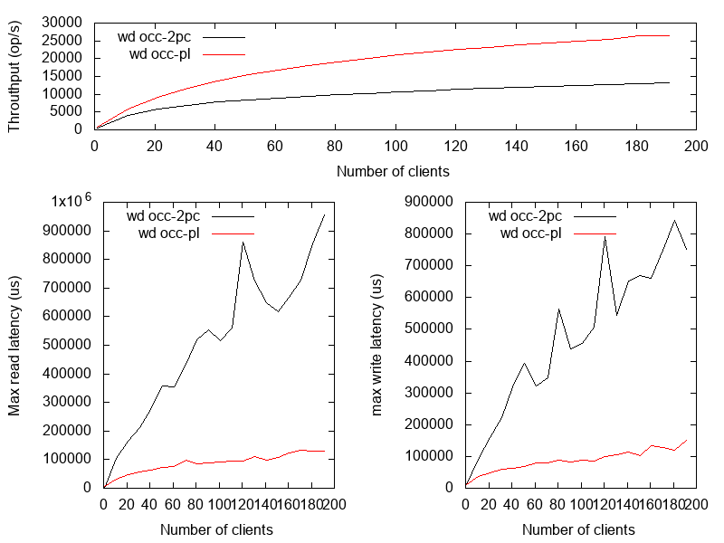

# simdistsys

simdistsys simulates a datacenter and tests several distributed algorithms in a controlled (simulated) environment.

## How to make an experiment?

### Install dotnet core 3.1 (macOS, linux or windows)

https://dotnet.microsoft.com/download

### Run the experiment

```bash
dotnet run -- tx coordinated occ-pl --from-clients 1 --to-clients 200 --delta 10 --duration-sec 120 --deadlock-prevention no-wait
dotnet run -- tx uncoordinated occ-2pc --from-clients 1 --to-clients 200 --delta 10 --duration-sec 120
```

## Simulated specs

### Network

| Property | Value |
| --- | --- |
| Throughput | 5 Gbps |
| RTT latency | 140us |

### Disk

| Property | Value |
| --- | --- |
| Throughput | 9 Gbps |
| Latency | 30us |
| Fsync | 2000us |

## Transactions

simdistsys transactions simulate a banking scenario where clients either do transfer or check accounts. Each client works in a loop and during an iteration randomly decides whether to perform transfer or to check with probability 1 to 4. On transfer it selects two random accounts and transfers a bit of value between them. On check it selects two random accounts and checks balance.

By default simdistsys simulates 10 data nodes where each is responsible for 30 accounts. So by  increasing the number of clients we increase the probability of conflicts.


### Insights

The charts focus on throughput and max latency and ignore p99 because the former stay meaningful when an experiment is design without taking coordinated omission into consideration.

"No wait" deadlock prevention scheme gives highest throuthput while "wait die" gives best latency.



Out of client side 2PC transactions occ-2pc gives highest throuthput and best read latency while 2pc with the read/write locks segregation gives best write latency.



Client side occ [parallel commits](https://www.cockroachlabs.com/blog/parallel-commits/) outperforms occ 2pc under low contention but breaks faster when rate of collision increases.



Faster transactions reduce a chance of conflicts and reduces **retries** so latency of the lock based transactions non linearly depends on latency of the non conflicting transactions. Parallel commits protocol is 2x faster than 2PC but the latency of lock based parallel commits is 10x better than the lock based 2PC version.

